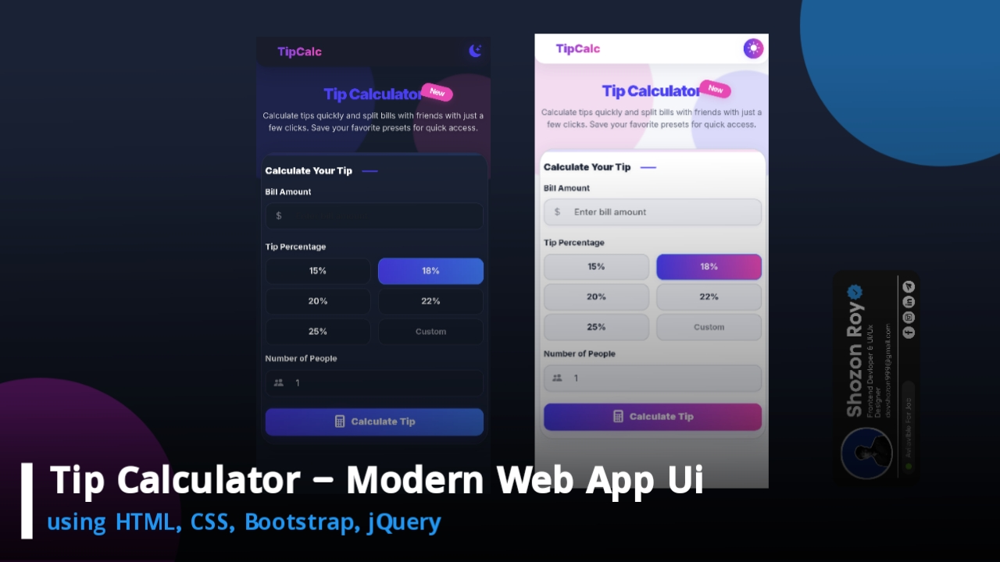

# Tip Calculator

A beautifully designed, modern tip calculator web app. Instantly calculate tips, split bills with friends, and customize tip percentages—all in a sleek, responsive UI with dark/light mode support.

## 📷 Image Preview

---

## 📝 Overview

**Tip Calculator** is a responsive and easy-to-use web application for quickly figuring out tip amounts and splitting bills. The interface is inspired by premium mobile apps and built using HTML, CSS, Bootstrap, jQuery, and modern best practices. Perfect for restaurants, group outings, and anyone wanting a fast, elegant tip calculation tool.

---

## ✨ Features

- **Modern, mobile-first UI** with a glassmorphism effect and glowing gradients
- **Dark and light mode** toggle with smooth transitions
- **Quick tip presets** (15%, 18%, 20%, 22%, 25%) and **custom tip input**
- **Split bill** by any number of people
- **Real-time calculation** with detailed per-person breakdown
- **Responsive design** for all devices
- **Bootstrap icons** and Inter font for a premium look
- **Accessible**: keyboard navigation and input focus

---

---

## 🛠️ Technology Used

- **HTML5** & **CSS3** (with custom variables)
- **Bootstrap 5** (layout, components)
- **Bootstrap Icons**
- **Google Fonts: Inter**
- **jQuery** (logic and interactivity)
- **Vanilla JS** (theme switcher & calculator logic)

---

## 🚀 Live Demo

[Open Live Demo](#) 

## 👤 Author

**Shozon Roy**  
- [GitHub](https://github.com/Shozon-Roy)

---

## 📄 License

This project is open-source and free to use.

---

> **Enjoy using Tip Calculator!**  
> If you like this project, feel free to star ⭐ the repo and share with others!
